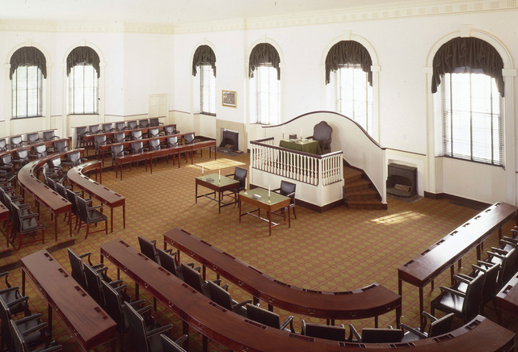

## An Underrated Speech
Author: [3yekn](https://github.com/3yekn)

On June 30, 2000, just six months after our harrowing survival of Y2K, President Bill Clinton signed into law the [Electronic Signatures in Global and National Commerce Act](https://uscode.house.gov/view.xhtml?req=granuleid%3AUSC-prelim-title15-chapter96&saved=%7CZ3JhbnVsZWlkOlVTQy1wcmVsaW0tdGl0bGUxNS1zZWN0aW9uNzAwMQ%3D%3D%7C%7C%7C0%7Cfalse%7Cprelim&edition=prelim). His speech took place in Congress Hall in Philadelphia, where Congress ratified the United States Bill of Rights in 1791.

President Clinton's speech is especially salient for our times. 

It is inspiring and features a live presidential demo that erupts to thundering applause. The president provided a compelling glimpse into the possibilities of the innovation of the time. The speech is a reminder of our current challenge - the unfortunate absence of national or executive branch leadership on modern Digitalness. 

Watch the 12 minute speech below, he starts with:

> *Two hundred and thirteen years ago, about 100 feet from where we are now, in a summer as hot as this one, the Founding Fathers drafted the Constitution of the United States.*

 

> *In the very first article of that document, they wrote that, government shall make no laws, 'impairing the obligation of contracts.' James Madison called the contract clause -- and I quote again -- 'a constitutional bulwark in favor of personal security and private rights.' He and his fellow framers understood that the right of individuals to enter into commercial contracts was fundamental not just for economic growth, but for the preservation of liberty itself.*

He later shares his easy to understand, fair principles that served as guidance for the legislation.

> *We said that the rules should be simple and nonregulatory, that they should not favor one technology over another, and they should give individuals and organizations maximum freedom to form electronic contracts as they see fit. I'm grateful that Congress has kept those principles in mind as it drafted the Electronic Signatures Act.*

Twenty-one years later, the mentions of bipartisanship and common future sound foreign. He mentioned that there was...

> *… a new vision of government and politics that marries our most enduring values to the demands of the new Information Age. In many ways, the Electronic Signatures Act exemplifies that vision. It shows what we in Washington can accomplish when we put progress above partisanship, when we reach across party lines to work for the American people and our common future.*

The demonstration reminds us that this was six years before the launch of the iPhone, and smartphones of course became more ubiquitous than the e-card used in the demonstration. President Clinton finishes with a look ahead...

> *And all of you young people will someday look back on this day that you were here and marvel that we thought it was any big deal. And that will be the ultimate test of success.*

# Digitalness
[Wyoming’s Select Committee on Blockchain, Financial Technology and Digital Innovation Technology](https://www.wyoleg.gov/Committees/2022/S19) has architected 25 bills on Digitalness that have been enacted into law. The purpose of this legislation, as [Senator Rothfuss](https://twitter.com/rothfuss) expressed during a session last year, is **"to enable, not to restrict."**  

Digitalness clarity is a new mechanism for digital attestation like the Electronic Signature Act 20 years ago; it establishes a holistic framework for digital identity, assets, and organizations.  

Digitalness empowers people to govern shared goals and assets at an unprecedented speed, durability, and adaptability. This breakthrough innovation will drive economic innovation throughout the 21st century.

This Digitalness legislation is broader in scope and scale, yet is cut from the same cloth as the Electronic Signatures Act.  At their core, they both serve to **"marr[y] our most enduring values to the demands of the new [Digitalness] Age... for the preservation of liberty itself"**.
***
Read [Digitalness: Part 2 of 3 - Digitalness Primer](/articles/digitalness-part-2)

Read [Digitalness: Part 3 of 3 - Step by Step DAO Proof of Concept](/articles/digitalness-part-3)
