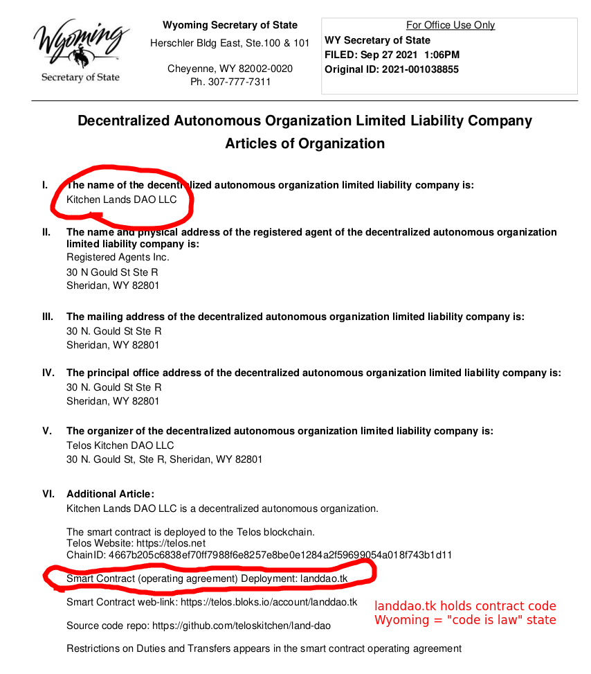
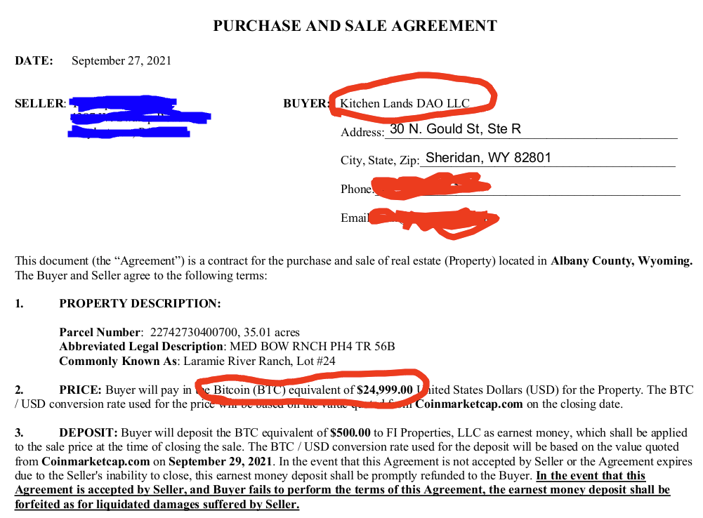
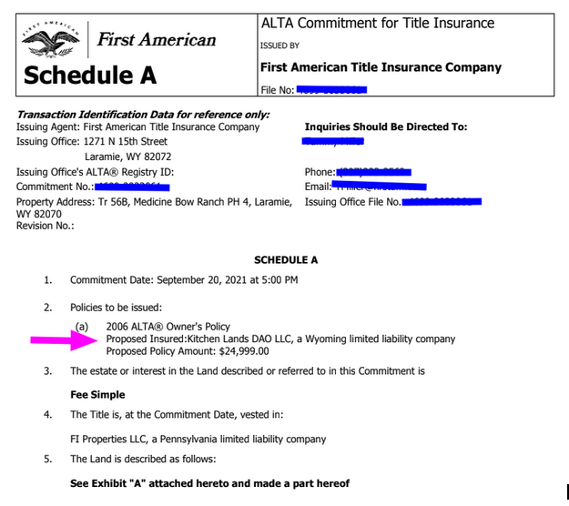
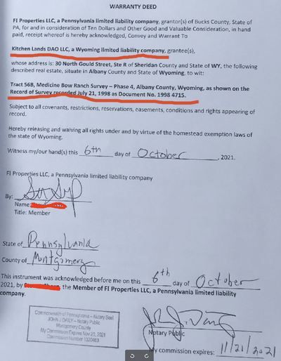
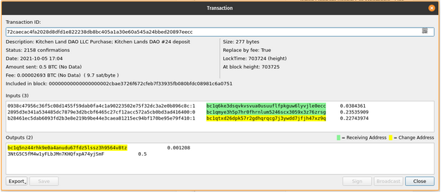
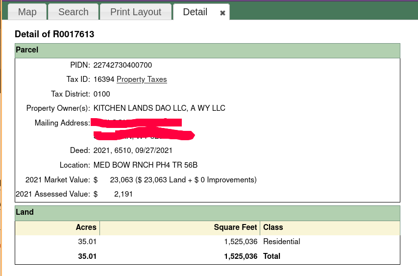

## Kitchen Lands DAO LLC buys 35 acres in Wyoming
Author: [3yekn](https://github.com/3yekn)

In the prior article, we shared the breakdown of our understanding of [Wyoming's new Digitalness legislation](/articles/digitalness-part-2/).

I'm excited to share that we have implemented them in a real-world proof of concept. We created a new business: **Kitchen Lands DAO LLC**, and that DAO purchased 35 beautiful acres outside of Laramie, Wyoming.

We took a methodical approach to the activities described below. Our goal to ensure that the DAO was decentralized and transparent from genesis. This article explains the play-by-play.

#### Step 1. Genesis member key ceremony
Every DAO starts as an idea, usually from a single person, before it is born. This single person usually recruits additional founding members. Although not required, we held a key ceremony with the founding members.

Another common genesis event is likely a crowdfunding contract, where contributions codify the members and genesis tokenization.

#### Step 2. Create an account
The [blockchain account](https://eosauthority.com/account/landdao.tk?network=telos#keys) was created and configured for multisignature based on the founding members. 

This may also be achieved using the fully sovereign, direct democracy permission from the start, meaning the only permission on the blockchain account would be the `landdao.tk@eosio.code` permission. Since the number of genesis members was small, we elected for multisignature for simplicity.

#### Step 3. Deploy contract
We use a [document-graph smart contract](https://hashed-io.github.io/document-graph-book/) to serve as a flexible and powerful store for DAO information. This allows us to store any arbitrary key value pairs, DAO policies, documentation, files, images, videos, and so on in a format that is easy to access and update via governance rules.

#### Step 4. Register the DAO LLC
The DAO LLC must be registered by an organizer, who may or may not be a member of the DAO. The organizer of Kitchen Lands DAO LLC was Telos Kitchen DAO LLC, a block producer on Telos.

As mentioned in our prior article, there is a set of information required specifically for DAO LLCs. Here is our Additional Article with this information.

```
Kitchen Lands DAO LLC is a decentralized autonomous organization.

The smart contract is deployed to the Telos blockchain.

Telos Website: https://telos.net
ChainID: 4667b205c6838ef70ff7988f6e8257e8be0e1284a2f59699054a018f743b1d11

Smart Contract (operating agreement) Deployment: landdao.tk
Smart Contract web-link: https://telos.bloks.io/account/landdao.tk

Source code repo: https://github.com/teloskitchen/land-dao

Restrictions on Duties and Transfers appears in the smart contract operating agreement
```
At this point, our LLC is registered and has been filed with the Wyoming Secretary of State. The document is publicly available online and has a section indicated that it has been filed. 

It also includes a Certificate of Organization signed by the Secretary of State of Wyoming.


#### Step 5. Enable Memberships
The Act requires that the public smart contract identifier be referenced in the Articles of Organization, and some members may not want to join a DAO that doesn’t have the proper LLC registration. This is why we adhere to the sequence of: a) create the account, b) deploy the contract, c) register the DAO LLC, and then d) allow members to join.

Members joined Kitchen Lands DAO LLC by sending TLOS tokens to the `landdao.tk` contract. (enrollment is closed; do not send any tokens)

You can [view the transaction on the block explorer](https://eosauthority.com/transaction/4199fcbab0c8a932b52057c534b140df0f66a295e1d6cb9a7dce9692e5492d74?network=telos#)

#### Step 6. Distribute initial DAO tokens
Kitchen Lands DAO LLC elected to create a distribute token with the following configuration:

Symbol:             `LAND`

Precision:          0   (no decimal places)

Maximum Quantity:   100

This means each `LAND` token is equivalent to 1% of the DAO and the smallest fractional ownership of the DAO is 1%, 

At this point, the DAO received contributions of `50,000.0000 TLOS` from three members, in proportions of 45%, 45%, and 10%.

#### Step 7. Go Shopping! 
After much research, the DAO members decided on a 35 acre property just northwest of Laramie in the Laramie River Ranch community. 


[See full property details](https://horizonlandsales.com/property/laramie-river-ranch-lot-45-35-84-acres/)

To avoid the slowness and hassle of fiat, we made our offer in Bitcoin and the seller was happy to accept it. 

We made an offer at the list price with the conversion rate of USD to Bitcoin to be made at the time of the transactions. Of course, the buyer is Kitchen Lands DAO LLC.



#### Step 8. Title Insurance
Title insurance is an optional step, but generally regarded as a best practice when purchasing real estate. The hired insurance company investigates the property to make sure that there are no outstanding liens, judgments, or back taxes. If it later becomes evident that there were some judgments or liens against the property, the insurance company will guarantee or fix it up to the purchase amount. 

Kitchen Lands DAO LLC is the insurance policy holder, as seen in the below policy snippet.



#### Step 9. Settlement
At this point, the funds can be transferred to the seller and the property deeded to the DAO. Many real estate transactions involve the use of an escrow agent. The price of bitcoin escrow services is very high (10% of the escrow amount).  Because of this cost, along with the relationship we had established with the seller and the size of the transaction, the DAO voted and elected not to use an escrow agent.

So, two events occurred simultaneously: 
The seller signed, had notarized, and emailed the Deed that grants the property to Kitchen Lands DAO LLC.


Kitchen Lands DAO LLC sent the Bitcoin to the seller.


[Open on block explorer](https://www.blockchain.com/btc/tx/72caecac4fa2028d8dfd1e822238db8bc405a1a30e60a545a24bbed20897eecc)

#### Step 10. File the Original Deed with the Albany County Clerk
The final step of the transaction, which is often handled by an escrow agent, is to file the signed deed in the county where the property is located. Across the USA, counties are responsible for knowing which entities own each real property in that county. Among other reasons, this is required because property tax falls to the jurisdiction of counties and they need to know who to send the bill to.



[County Property Detail Page](https://maps.greenwoodmap.com/albany/map#zcr=17.00366750385988/-11764707.2/5138229.5/0&lyrs=publand,townlim,ownership,roads)
#### Step 11. Ongoing Maintenance 
There are some ongoing maintenance activities associated with owning real estate and also keeping LLC records current. These duties and costs are shown below.

- [Annual Property taxes](https://itax.tylertech.com/AlbanyWY/detail.aspx?taxid=16394): `$129.87`
- Community dues:  `$120.00`
- Wyoming LLC fee:  `$60.00`

There would be obviously consequences for not performing these maintenance activities, including loss of the property itself. Kitchen Lands DAO LLC maintains an on-chain reserve to cover these for years to come, and a member or hired agent will be responsible for handling the transactions.

If an existing reserve ran out, a DAO could issue more tokens in exchange for contributors replenishing the reserve. Like any LLC, the DAO members are incentivized to ensure these obligations get paid.

*** 
If you made it this far, thank you for learning about our DAO LLC proof of concept with Kitchen Lands DAO LLC. If you appreciate this work, please vote for Telos Kitchen as block producer on the Telos blockchain.

Read [Digitalness: Part 1 of 3 - An Underrated Speech](/articles/digitalness-part-1/)

Read [Digitalness: Part 2 of 3 - Digitalness Primer](/articles/digitalness-part-2)
